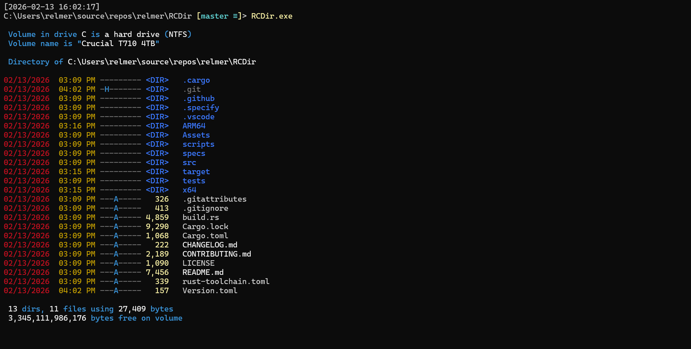

# RCDir

[](https://github.com/relmer/RCDir/actions/workflows/ci.yml)
[](https://github.com/relmer/RCDir/releases/latest)
[](LICENSE)
<!--
[](https://github.com/relmer/RCDir/releases)
-->
This is a Rust port of [TCDir](https://github.com/relmer/TCDir), the original C++ implementation.  Features generally show up in TCDir first, and I try to get them ported to RCDir within a week or so.

RCDir ("Rust Colorized Directory") is a fast, colorized directory listing tool for Windows consoles.
It's designed as a practical `dir`-style command with useful defaults (color by extension/attributes, Nerd Font file/folder icons, sorting, recursion, wide output, and a multi-threaded enumerator).



## What's New

| Version | Highlights |
|---------|------------|
| **5.5** | Ellipsize long link target paths — middle-truncate with `…` to prevent line wrapping |
| **5.4** | Symlink, junction, and AppExecLink target display (`→ target`) |
| **5.3** | Config file support (`.rcdirconfig`), `--config` diagnostics, `--settings` merged view |
| **5.2** | Interactive PowerShell alias configuration (`--set-aliases`, `--get-aliases`, `--remove-aliases`) |
| **5.1** | `--Tree` hierarchical directory view with depth control |
| **5.0** | Nerd Font file/folder icons (~187 extensions, ~65 directories) |

See [CHANGELOG.md](CHANGELOG.md) for full release history.

Hat tip to [Chris Kirmse](https://github.com/ckirmse) whose excellent [ZDir](https://github.com/ckirmse/ZDir) from the '90s was the original inspiration for TCDir/RCDir.

## Why RCDir?

| Feature | `dir` | RCDir | [eza](https://github.com/eza-community/eza) | [lsd](https://github.com/lsd-rs/lsd) |
| --- | :---: | :---: | :---: | :---: |
| Color-coded by extension & attribute | — | ✅ | ✅ | ✅ |
| Cloud sync status (OneDrive, iCloud) | — | ✅ | — | — |
| Nerd Font file/folder icons | — | ✅ | ✅ | ✅ |
| Tree view with full metadata | — | ✅ | ✅ | ✅ |
| Multi-threaded enumeration | — | ✅ | — | — |
| Native Windows (no WSL/MSYS) | ✅ | ✅ | ⚠️ | ⚠️ |
| Familiar `dir` switch syntax | ✅ | ✅ | — | — |
| Symlink/junction target display | — | ✅ | ✅ | ✅ |
| ARM64 native binary | ✅ | ✅ | — | — |
| NTFS alternate data streams | ✅ | ✅ | — | — |
| Configurable via environment variable | — | ✅ | — | — |
| Configurable via config file          | — | ✅ | ✅ | ✅ |

## Installation

### Download

Grab the latest binary for your architecture:

- [**rcdir.exe**](https://github.com/relmer/RCDir/releases/latest/download/rcdir.exe) — x64 (Intel/AMD 64-bit)
- [**rcdir-ARM64.exe**](https://github.com/relmer/RCDir/releases/latest/download/rcdir-ARM64.exe) — ARM64 (Snapdragon, etc.)

Place the `.exe` somewhere on your `PATH`, or add its directory to your `PATH`.

See all releases on the [Releases page](https://github.com/relmer/RCDir/releases).

<!--
### Package managers (coming soon)

```powershell
winget install relmer.RCDir
scoop install rcdir
```
-->

### Shell integration

Make RCDir your default directory listing command:

```powershell
# Add to your PowerShell profile ($PROFILE):
Set-Alias dir rcdir -Option AllScope
```

## Requirements

- Windows 10/11
- PowerShell 7 (`pwsh`) to run the build/test scripts
- Rust toolchain (install from <https://rustup.rs/>)
  - Targets: `x86_64-pc-windows-msvc`, `aarch64-pc-windows-msvc`
  - Install with: `rustup target add x86_64-pc-windows-msvc aarch64-pc-windows-msvc`
- Optional: VS Code with rust-analyzer extension

### First-time setup

Run the setup script to install or verify all Rust prerequisites automatically:

```powershell
.\scripts\Setup.ps1
```

Alternatively, the `rust-toolchain.toml` at the repo root will prompt `rustup` to install the correct toolchain, targets, and components automatically whenever you run `cargo`.

## Quick start

Build:

- VS Code: run a build task (e.g. **Build Release (current arch)**)
- Command line: `pwsh -NoProfile -ExecutionPolicy Bypass -File .\scripts\Build.ps1 -Configuration Release`

Run:

- `.\target\x86_64-pc-windows-msvc\release\rcdir.exe`
- `.\target\aarch64-pc-windows-msvc\release\rcdir.exe`

## Usage

Show help:

- `rcdir.exe -?`


Basic syntax:

- `RCDIR [drive:][path][filename] [-A[[:]attributes]] [-O[[:]sortorder]] [-T[[:]timefield]] [-S] [-W] [-B] [-P] [-M] [--Env] [--Config] [--Settings] [--Owner] [--Streams] [--Icons] [--Tree] [--Depth=N] [--TreeIndent=N] [--Size=Auto|Bytes]`

Common switches:

- `-A[:]<attributes>`: filter by file attributes
- `-O[:]<sortorder>`: sort results
  - both `-oe` and `-o:e` forms are supported
  - `N` name, `E` extension, `S` size, `D` date/time
  - prefix `-` to reverse
- `-T:<timefield>`: select which timestamp to display and sort by
  - `C` creation time, `A` last access time, `W` last write time (default)
- `-S`: recurse into subdirectories
- `-W`: wide listing format
- `-B`: bare listing format
- `-P`: show performance timing information
- `-M`: enable multi-threaded enumeration (default); use `-M-` to disable
- `--Env`: show `RCDIR` environment variable help/syntax/current value
- `--Config`: show config file diagnostics, syntax reference, and parse errors
- `--Settings`: show current merged configuration for all items and extensions
- `--Owner`: display file owner (DOMAIN\User format); not allowed with `--Tree`
- `--Streams`: display NTFS alternate data streams
- `--Icons`: enable Nerd Font file/folder icons; use `--Icons-` to disable
- `--Tree`: hierarchical directory tree view; use `--Tree-` to disable
- `--Depth=N`: limit tree depth to N levels (requires `--Tree`)
- `--TreeIndent=N`: tree indent width per level, 1–8, default 4 (requires `--Tree`)
- `--Size=Auto|Bytes`: `Auto` shows abbreviated sizes (e.g., `8.90 KB`); `Bytes` shows exact comma-separated sizes. Tree mode defaults to `Auto`, non-tree defaults to `Bytes`

### Attribute filters (`/A:`)

Standard attributes: `D` (directory), `H` (hidden), `S` (system), `R` (read-only), `A` (archive)

Cloud sync attributes (OneDrive, iCloud, etc.):

- `O` - cloud-only placeholder files (not locally available)
- `L` - locally available files (hydrated, can be dehydrated)
- `V` - pinned/always available files (won't be dehydrated)

Extended attributes:

- `X` - not content indexed (excluded from Windows Search)
- `I` - integrity stream enabled (ReFS only)
- `B` - no scrub data (ReFS only)
- `F` - sparse file
- `U` - unpinned (allow dehydration)

Use `-` prefix to exclude (e.g., `/A:-H` excludes hidden files).

### Cloud file visualization

When browsing cloud-synced folders (OneDrive, iCloud Drive, etc.), RCDir displays sync status symbols:

- `○` (hollow) - cloud-only placeholder, not available offline
- `◐` (half) - locally available, can be dehydrated
- `●` (solid) - pinned, always available offline

When a Nerd Font is detected, the cloud symbols are automatically upgraded to dedicated NF glyphs (cloud-outline, cloud-check, pin).

### Nerd Font icons

When RCDir detects a [Nerd Font](https://www.nerdfonts.com/) in the console, it automatically displays file and folder icons next to each entry — in normal, wide, and bare listing modes.

Detection works via:

1. **GDI glyph probe** — renders a canary glyph to confirm Nerd Font symbols are available in the active console font
2. **System font enumeration** — checks whether any installed font's name contains "Nerd Font" or a "NF", "NFM", or "NFP" suffix
3. **WezTerm detection** — WezTerm bundles Nerd Font symbols natively, so icons are enabled automatically
4. **ConPTY detection** — Windows Terminal, VS Code terminal, and other modern terminals are recognized

Icon mappings (~187 extensions, ~65 well-known directories) are aligned with the [Terminal-Icons](https://github.com/devblackops/Terminal-Icons) PowerShell module default theme.

Use `--Icons` to force icons on, or `--Icons-` to force them off, regardless of detection.

### Tree view (`--Tree`)

Tree mode displays the directory hierarchy with Unicode box-drawing connectors (`├──`, `└──`, `│`). All metadata columns (date, time, attributes, size, cloud status) appear at every level. Directories and files are sorted together (interleaved) rather than grouped.

- `rcdir --Tree` — show full tree from the current directory
- `rcdir --Tree --Depth=2` — show only 2 levels deep
- `rcdir --Tree --TreeIndent=2` — narrower indentation (default is 4)
- `rcdir --Tree *.rs` — show only `.rs` files; empty subdirectories are pruned

Tree mode uses abbreviated file sizes (`--Size=Auto`) by default for consistent column alignment across directories. Junction points and symlinks are listed but not expanded, preventing infinite cycles.

Incompatible with `-W` (wide), `-B` (bare), `-S` (recurse), `--Owner`, and `--Size=Bytes`.

- Tree listing: `rcdir.exe --Tree`


Examples:

- Recurse through subdirectories: `rcdir.exe -s`


- Wide listing: `rcdir.exe -w`


## Configuration (RCDIR environment variable)

RCDir supports customizing colors (and default switch behavior) via the `RCDIR` environment variable or a config file.

### Config file (`.rcdirconfig`)

Create `%USERPROFILE%\.rcdirconfig` with one setting per line, using the same syntax as the environment variable. Comments (`#`) and blank lines are supported:

```ini
# Switches
Tree
Icons

# Extension colors
.cpp = LightGreen
.h   = Yellow on Blue
.rs  = LightCyan

# Display attribute colors
D = LightBlue

# File attribute overrides
Attr:H = DarkGrey

# Icon overrides
.go = LightCyan, U+e627

# Parameterized settings
Depth = 3
Size = Auto
```

Precedence: built-in defaults < config file < `RCDIR` env var < CLI flags.

Use `rcdir --config` to see config file diagnostics, and `rcdir --settings` to see the merged configuration from all sources.

### Environment variable

Syntax:

- PowerShell: `$env:RCDIR = "[<Switch>] | [<Item> | Attr:<fileattr> | <.ext>] = <Fore> [on <Back>][;...]"`
- CMD: `set RCDIR=[<Switch>] | [<Item> | Attr:<fileattr> | <.ext>] = <Fore> [on <Back>][;...]`

**Note**: Switch names in the RCDIR variable do NOT include prefixes (`/`, `-`, `--`). Use just the switch name (e.g., `W`, `Owner`, `Streams`).

### Default switches

Enable default switches by including the switch name:

- `W` - enable wide listing by default
- `S` - enable subdirectory recursion by default
- `P` - enable performance timing by default
- `M` - enable multi-threading by default (already on by default)
- `B` - enable bare listing by default
- `Owner` - display file ownership by default
- `Streams` - display NTFS alternate data streams by default
- `Icons` - enable Nerd Font icons by default; `Icons-` to force off
- `Tree` - enable tree view by default; `Tree-` to force off
- `Depth=N` - set default tree depth limit
- `TreeIndent=N` - set default tree indent width (1–8)
- `Size=Auto` / `Size=Bytes` - set default size display format

### Color customization

Configure colors for display items, file attributes, and extensions:

Example:

- PowerShell: `$env:RCDIR = "W;D=LightGreen;S=Yellow;Attr:H=DarkGrey;.png=Black on Magenta"`
- CMD: `set RCDIR=W;D=LightGreen;S=Yellow;Attr:H=DarkGrey;.png=Black on Magenta`

Decoded breakdown of the example:

- `W` sets the default switch `/W` (wide listing) on
- `D=LightGreen` sets the **Date** display item color to LightGreen
- `S=Yellow` sets the **Size** display item color to Yellow
- `Attr:H=DarkGrey` sets the **Hidden** file attribute color to DarkGrey
- `.png=Black on Magenta` sets the `.png` extension color to black text on a magenta background

Display items for color configuration:

- `D` (Date), `S` (Size), `N` (Name), `Attr` (Attributes)
- `CloudOnly`, `Local`, `Pinned` - cloud sync status symbol colors

Icon override (`<.ext>=<Color>,U+<codepoint>`):

- Override the icon glyph for any extension: `.rs=DarkRed,U+E7A8`
- Color-only override (keep default glyph): `.js=Yellow`
- Glyph-only override (keep default color): `.md=,U+F48A`

File attribute colors (`Attr:<letter>`):

- `H` (hidden), `S` (system), `R` (read-only), `D` (directory)

- Here's an example of the default output, setting the RCDIR environment variable, then showing its effects:


To see the full list of supported colors and a nicely formatted explanation, use --Env.

- Any errors in the RCDIR variable are shown at the end.
- `rcdir.exe --Env`:


To see your current color configuration, use --Config:

- All configuration settings are displayed along with the source of that configuration.
- `rcdir.exe --Config`:


## Building

### Build options

- VS Code: the repo includes `.vscode/tasks.json` with tasks wired up to `scripts/Build.ps1` and `scripts/RunTests.ps1`
- Command line: use the PowerShell build scripts below

### Build scripts

- Build: `pwsh -File .\scripts\Build.ps1 -Configuration <Debug|Release> -Platform <x64|ARM64> -Target Build`
- Clean: `pwsh -File .\scripts\Build.ps1 -Configuration <Debug|Release> -Platform <x64|ARM64> -Target Clean`
- Rebuild: `pwsh -File .\scripts\Build.ps1 -Configuration <Debug|Release> -Platform <x64|ARM64> -Target Rebuild`
- Build both Release targets: `pwsh -File .\scripts\Build.ps1 -Target BuildAllRelease`
- Run clippy lints: `pwsh -File .\scripts\Build.ps1 -Target Clippy`

Build outputs land under:

- `target\x86_64-pc-windows-msvc\debug\rcdir.exe`, `target\x86_64-pc-windows-msvc\release\rcdir.exe`
- `target\aarch64-pc-windows-msvc\debug\rcdir.exe`, `target\aarch64-pc-windows-msvc\release\rcdir.exe`

## Tests

Run unit tests:

- `pwsh -File .\scripts\RunTests.ps1`
- Or directly: `cargo test`

## Versioning

The version is managed in `Version.toml` and auto-stamped into the binary at build time by `build.rs`.

## License

MIT License. See `LICENSE`.
